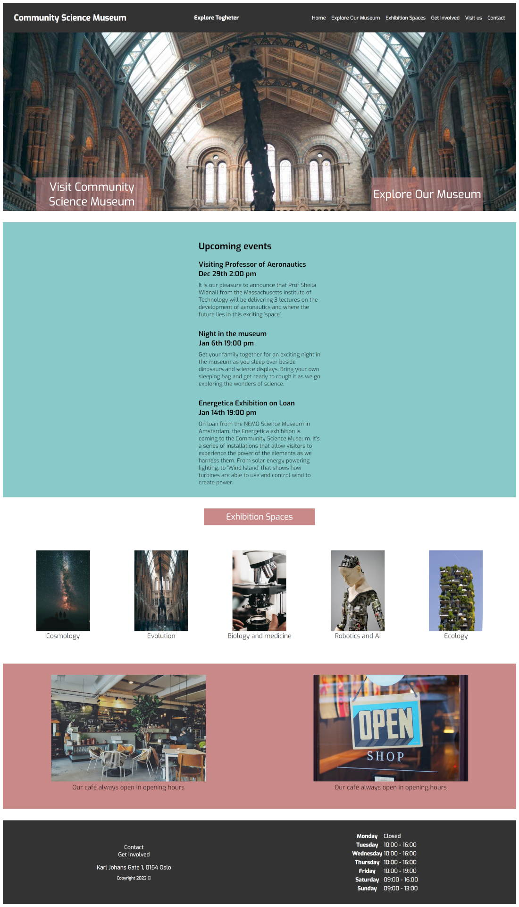

# Community Science Museum - Semester Project

This project is an interactive website developed for the Community Science Museum, a local science museum. The website aims to provide information, appeal, and engagement to its visitors. It was built using HTML, and CSS, ensuring responsiveness and usability across various devices. The site consists of multiple pages optimized for quick downloads and search engine optimization. Accessibility was prioritized, adhering to WCAG principles.

## Screenshots

## Pages

- Landing page 
- Explore Our Museum page 
- Exhibition spaces page 
- Get involved page 
- Visit Us page 
- Contact page

## Getting Started

To get this project up and running on your local machine, follow these steps:

1. Clone this repository: `git clone https://github.com/emilrh91/semester-project-1`
2. Navigate to the project folder: `cd semester-project-1`
3. Open the project in your preferred code editor.
4. Open the index.html file in a web browser. You may use extensions like Live Server in Visual Studio Code for a live preview of the website.

You should now be able to see the project running in your browser.

## Contact Me
Feel free to reach out to me on [LinkedIn](https://www.linkedin.com/in/emil-halvorsen-2380b3103/) for any inquiries or opportunities.

## Live Site
For a live version of the site, please visit: [Commmunity Science Museum](https://communitysciencemuseum-project.netlify.app/).
